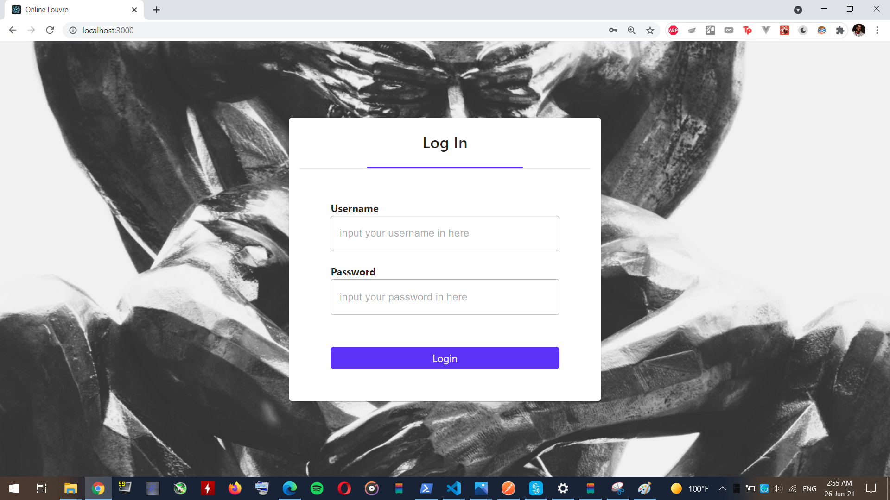
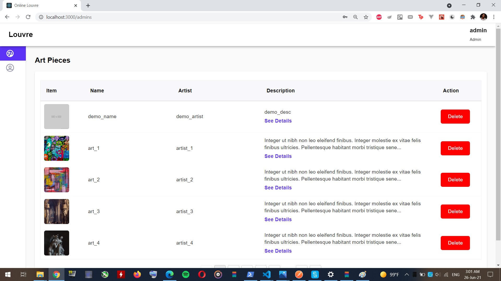
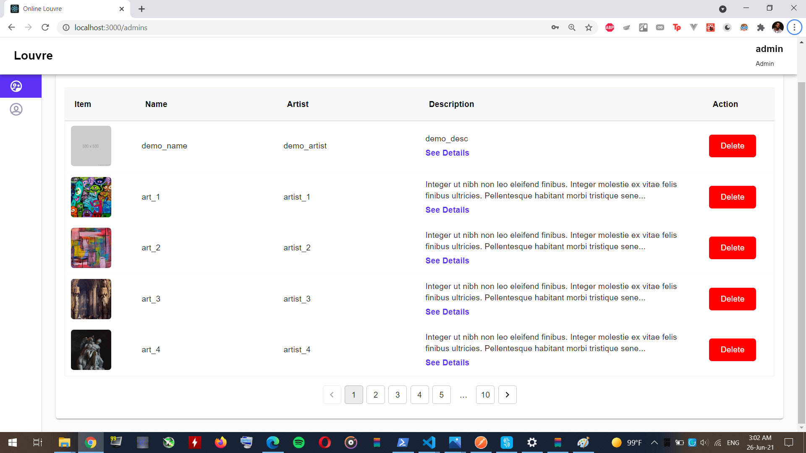
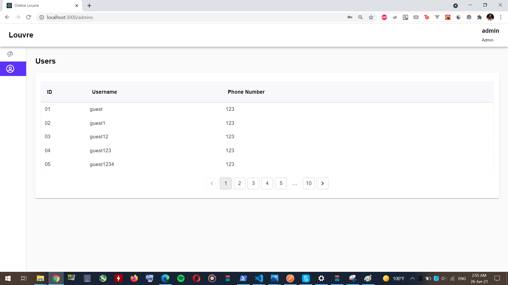
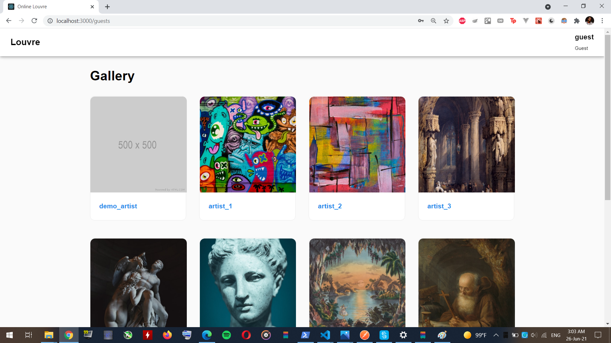
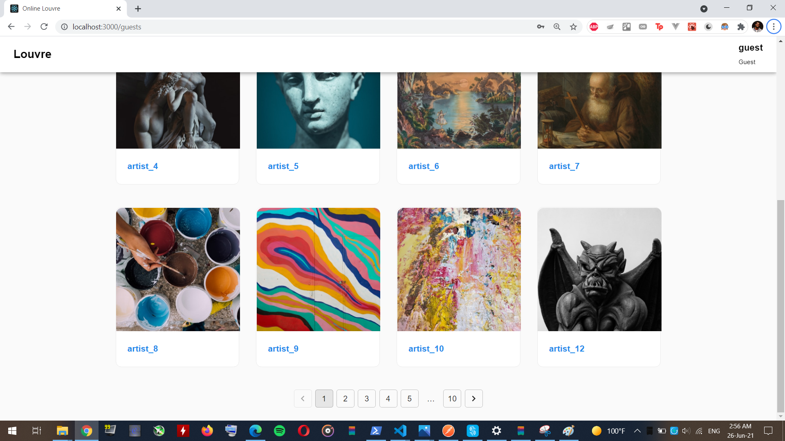
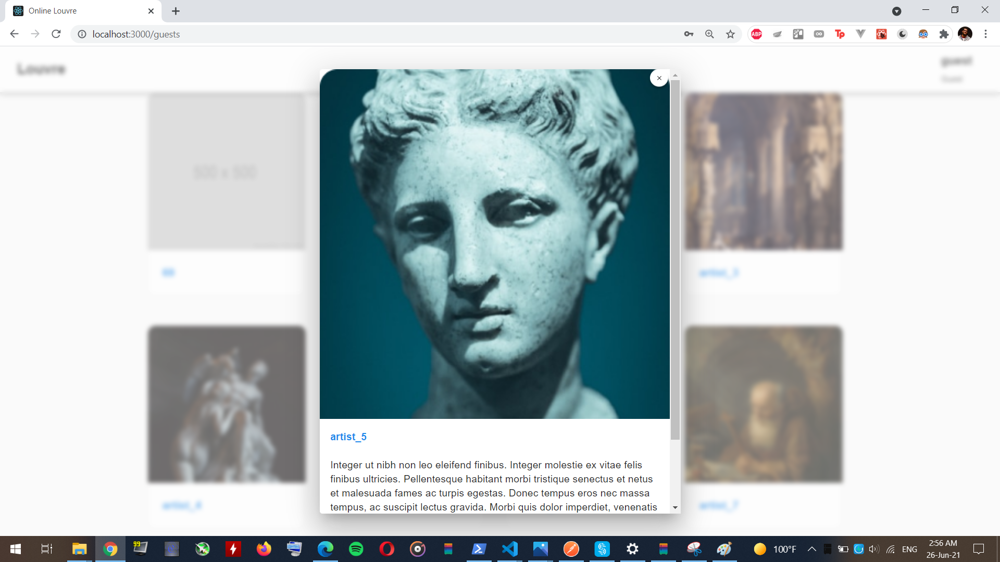
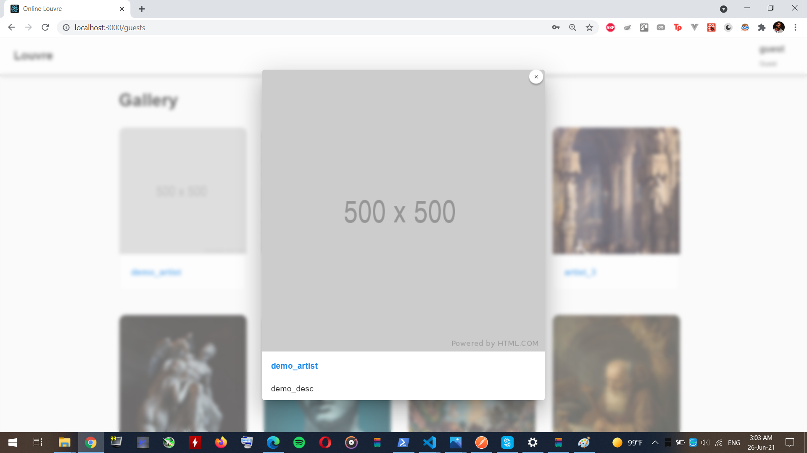

# LouvreOnline

Deployment link : https://louvre-online-frontend.herokuapp.com/

NB: For the commit history view the individual branches
## Setup for Local Testing

Pull the repo locally and open two terminals

### Backend

1. Create a `.env` file in the backend folder
2. Create a MongoCluster online and get the connection string
3. Add `MONGO_URI` variable to the `.env` and paste the connection string
4. Add `PORT` variable and choose a port for the app to listen on, if not specified it will run on port 4000
5. Add `SECRET` variable and choose a secret string for the authentication module
6. Use a terminal to run the the command `npm i`
6. When the previous command is done run the the command `npm run start`

Now the backend is running on the specified port

#### Dockerized Backend
To run a dockerized image of the backend run `sudo docker-compose up` in the backend folder

### Frontend

1. Create a `.env` file in the frontend folder
2. Add `REACT_APP_API_URL` variable to the `.env` and add `http://localhost:`+`PORT`+`/` which is the backend port number
3. Use a terminal to run the the command `npm i`
4. When the previous command is done run the the command `npm run start`

Now the frontend is running on the specified port

#### Dockerized Frontend
To run a dockerized image of the frontend run `sudo docker-compose up` in the frontend folder

### Screenshots

